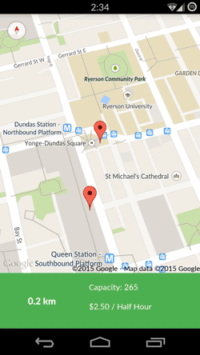

# Park-it
Driving in the heart of Toronto is a great experience. Food is great and the attractions are great! What's not great is when you need to find parking. What if you could just have a list of the closest parking lots with the price rate, the size of the lot and the address? Park-it does it all for you, all on the go.
Park-it is an Android application that uses Toronto Open Data and Google Maps to point you to the closest parking lot wherever you are (preferably in Toronto).

# About
This application was my way of teaching myself various aspects of Android in a fun way. I went to a Startup Hackathon a few months ago, and the focus of it was to use Open Data. I didn't win, but it was a great experience and I took a lot away from it. Since then, I really wanted to make something that could make my life slightly easier while utilizing the power of Open Data and the popularity of the Android Framework.

# How does it work?
Park-it uses "Green P Parking" taken from the Toronto Open Data resources online. It takes your current location and calculates the distance between you and the closest parking lots around. Because it is Toronto Open Data, this app really only works in Toronto.

#Lets get into more detail
Here's a breakdown on how everything works

## ParkingListActivity.java
Here is the first place where the user goes in Park-it. It sends an HTTP GET request to grab the data from Toronto's Open Data site. It then parses the returned JSON data and calculates the distance between your current location and the location of the parking.
When a ListItem is selected, it will add the data from the selected parking lot to a Parcelable object (since its faster than the Serializable object) where its sent to the activity containing Google Maps.
